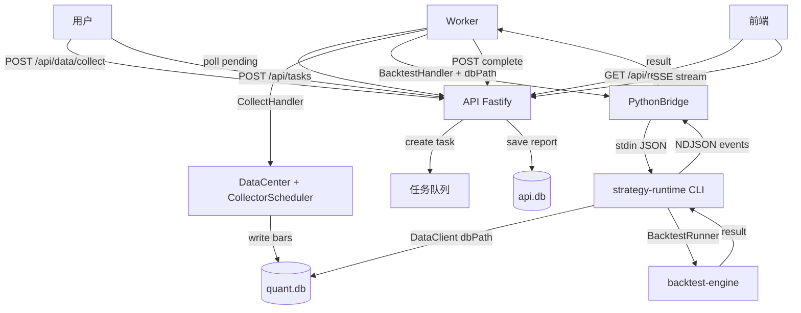

## 产品概述

本方案旨在解决两个核心问题：(1) 前期代码审查发现的 4 个依赖/边界违规问题；(2) 打通数据库链路断点，实现策略开发完整闭环。

## 核心功能

### 依赖边界修正

- 修复 ai-engine pyproject.toml 声明了未使用的 quantforge-strategy 依赖
- 更新 AGENTS.md 白名单：补充 data-client → strategy-runtime、obsidian-sync 的 4 项依赖、worker → data-collector
- 创建 loop-engine 骨架目录，包含 8 个类型定义（LoopType/LoopStatus/IterationStatus/LoopConfig/IterationRecord/LoopRecord/LoopCondition/LoopSummary）

### 数据库闭环打通

- Worker backtest-handler 显式传递 dbPath 给 Python CLI，消除隐式依赖
- 新增数据采集任务类型（Collect）和 CollectHandler，使数据采集可由系统内触发
- 新增 API `POST /api/data/collect` 端点，用户可通过 HTTP 触发数据采集
- 修复 Worker main.ts 的 handler 分发逻辑，当前所有任务类型都被路由到 BacktestHandler

### 策略开发完整闭环

用户触发数据采集 → 数据写入 quant.db → 用户提交回测 → Worker 显式传递 dbPath → Python DataClient 读取数据 → 回测引擎执行 → 结果返回 → API 保存报告 → 前端展示

## Tech Stack

- TypeScript (Worker、API、data-center、data-collector)
- Python (strategy-runtime、backtest-engine、factor-lab、ai-engine、data-client、obsidian-sync)
- SQLite (sql.js WASM + Drizzle ORM)
- Fastify (API HTTP 框架)
- pnpm workspace + Turborepo (monorepo 管理)

## Implementation Approach

### Part 1: 依赖边界修正

**问题 1 — ai-engine 未使用依赖：**
`packages/ai-engine/pyproject.toml` 声明了 `quantforge-strategy`，但 ai-engine 的所有模块（types.py、features.py、model.py、predictor.py）均未导入它。直接移除该声明。ai-engine 当前也不导入 data-client，白名单中的 `ai-engine -> data-client` 是预留允许项，无需添加未使用的依赖。

**问题 2 — data-client → strategy-runtime 方向不匹配：**
AGENTS.md 白名单声明 `strategy-runtime -> data-client`，但实际代码中 data-client 的 `client.py:10` 导入 `from quantforge_strategy import Bar, TimeFrame`。类型 Bar/TimeFrame 定义在 strategy-runtime 的 `market.py` 和 `types.py` 中，strategy-runtime 的 `pyproject.toml` 依赖为空（不依赖 data-client）。

实际依赖方向是 `data-client → strategy-runtime`，与白名单声明的方向相反。理想设计是将 Bar/TimeFrame 等类型迁移到 data-client，strategy-runtime 通过 re-export 引用——但这涉及 strategy-runtime、backtest-engine、factor-lab、strategies、obsidian-sync 等多包的导入路径修改，blast radius 过大。

**务实方案：** 在白名单中补充 `packages/data-client -> packages/strategy-runtime`，接受当前依赖方向。理想重构标记为后续改进。

**问题 3 — obsidian-sync 依赖超白名单：**
obsidian-sync 的 `sync.py` 导入了 `quantforge_strategy.StrategyMeta`、`quantforge_backtest.BacktestResult`、`quantforge_factor.FactorDefinition/FactorMetrics`、`quantforge_data.DataClient`。这是生成 Obsidian 笔记的合理需求。更新白名单，增加 obsidian-sync 对 strategy-runtime、backtest-engine、factor-lab 的依赖许可。

**问题 4 — loop-engine 目录缺失：**
AGENTS.md 定义了循环引擎角色和 8 个类型归属，但 `packages/` 下无 loop-engine 目录。创建骨架目录，包含 `pyproject.toml`（无外部依赖）、`__init__.py`、`types.py`（定义 8 个类型的枚举和 dataclass 骨架）、`py.typed`。

### Part 2: 数据库闭环打通

**断裂点 1 — Worker 未显式传递 dbPath：**
`apps/worker/src/handlers/backtest-handler.ts:42-48` 构造 `dataRange` 时只有 symbol/timeframe/startTs/endTs，无 dbPath。Python 侧 `backtest.py:27` 默认 `data_range.get("dbPath", "data/quant.db")`，依赖 PythonBridge 设置 cwd 为项目根目录使相对路径可解析。这虽能工作但脆弱——如果 cwd 不正确或数据库路径变更，回测静默失败。

**修复方案：** Worker 解析 dbPath（`process.env.DB_PATH` 或项目根 `data/quant.db`），显式传入 `dataRange.dbPath`。同时修复 main.ts 中所有任务类型都被路由到 BacktestHandler 的 bug。

**断裂点 2 — 数据采集器无系统化入口：**
数据采集器已完整实现（6 个数据源适配器、清洗器、调度器、预设任务），但仅能通过手动 `npx tsx scripts/seed-data.ts` 触发。API 的 `/api/data` 路由只有查询端点（/instruments、/bars、/coverage、/quality），Worker 的 TaskType 枚举无 Collect 类型，handlers 目录无 collect-handler。

**修复方案：**

1. Worker 和 API 的 TaskType 枚举新增 `Collect = 'collect'`
2. Worker package.json 新增 `@quant/data-collector` 依赖
3. 创建 `CollectHandler`：接收采集参数 → 创建 DataCenter（persistence: immediate）→ 创建 CollectorScheduler → 执行 CollectorPresets 任务 → 关闭 DataCenter
4. API 新增 `POST /api/data/collect` 端点：创建 collect 类型任务，由 Worker 异步执行
5. Worker main.ts 重构 handler 分发：根据 task.type 选择对应 handler

**断裂点 3 — Worker main.ts handler 分发缺陷：**
`main.ts:57` 硬编码 `supportedTypes = ['backtest', 'factor_compute', 'factor_eval']`，但 `main.ts:67` 始终创建 `new BacktestHandler(bridge)` 处理所有类型。factor_compute 和 factor_eval 任务被错误地交给 BacktestHandler。需要重构为按类型分发。

### Architecture Design



### Directory Structure

```
项目根/
├── AGENTS.md                              # [MODIFY] 更新依赖白名单（3 处新增）
├── packages/
│   ├── ai-engine/
│   │   └── pyproject.toml                 # [MODIFY] 移除 quantforge-strategy
│   ├── loop-engine/                       # [NEW] 整个目录
│   │   ├── pyproject.toml                 # [NEW] 无外部依赖，纯类型骨架
│   │   ├── quantforge_loop/
│   │   │   ├── __init__.py                # [NEW] 导出 8 个类型
│   │   │   ├── types.py                   # [NEW] LoopType/LoopStatus/IterationStatus 枚举 + LoopConfig/IterationRecord/LoopRecord/LoopCondition/LoopSummary dataclass
│   │   │   └── py.typed                   # [NEW] 类型标记
│   │   └── tests/
│   │       └── test_types.py              # [NEW] 类型骨架基础测试
├── apps/
│   ├── api/
│   │   ├── src/
│   │   │   ├── types.ts                   # [MODIFY] 新增 TaskType.Collect
│   │   │   └── routes/data.ts             # [MODIFY] 新增 POST /collect 端点
│   │   └── package.json                   # [无需修改] API 不直接依赖 data-collector
│   └── worker/
│       ├── package.json                   # [MODIFY] 新增 @quant/data-collector 依赖
│       └── src/
│           ├── types.ts                   # [MODIFY] 新增 TaskType.Collect
│           ├── handlers/
│           │   ├── backtest-handler.ts    # [MODIFY] dataRange 显式传入 dbPath
│           │   └── collect-handler.ts     # [NEW] 数据采集任务处理器
│           └── main.ts                    # [MODIFY] 重构 handler 分发 + dbPath 解析
```

### Key Code Structures

CollectHandler 核心接口：

```typescript
// apps/worker/src/handlers/collect-handler.ts
export interface CollectPayload {
  symbols: string[];
  source: string;           // 'baostock' | 'akshare' | 'csv' | ...
  dataType: string;         // 'bar' | 'instrument' | 'calendar' | ...
  start?: number;
  end?: number;
  dbPath?: string;          // 可选，默认从环境变量或项目根解析
}
```

backtest-handler dataRange 修正：

```typescript
// apps/worker/src/handlers/backtest-handler.ts
dataRange: {
  dbPath: payload.dbPath ?? resolveDbPath(),  // 显式传递
  symbol: payload.symbol,
  timeframe: payload.timeframe,
  startTs: payload.startTs,
  endTs: payload.endTs,
}
```

## Implementation Notes

### Performance

- CollectHandler 使用 `persistence: 'immediate'` 模式，每批写入后自动 flush，避免数据丢失
- 采集按 symbol 串行执行（与 seed-data.ts 一致），避免并发写入冲突
- Worker 串行处理任务（main.ts:118 `for...of`），collect 任务执行期间 block 后续任务，需设置合理超时

### Logging

- CollectHandler 通过 onEvent 回调上报进度（每个 symbol 采集完成后发 progress 事件）
- 采集失败的非阻塞处理：instrument 采集失败时 warn 但继续（与 seed-data.ts:57-59 一致）
- bar 采集失败时 error 但继续下一个 symbol（与 seed-data.ts:75-77 一致）

### Blast Radius Control

- ai-engine 移除 quantforge-strategy 依赖：ai-engine 代码不导入它，零影响
- AGENTS.md 白名单更新：仅添加许可，不移除现有许可，向后兼容
- backtest-handler 增加 dbPath：Python 侧已支持 `data_range.get("dbPath", ...)`，传入显式值不改变行为
- Worker main.ts 重构 handler 分发：当前只有 backtest 任务实际运行，重构后 collect 任务可运行，factor_compute/factor_eval 保持原有接口（未实现则返回 unsupported）
- loop-engine 骨架创建：纯新增目录，不影响现有代码

### 约束遵守

- API 层保持薄：`POST /api/data/collect` 只创建任务，不执行采集逻辑
- Worker 只编排：CollectHandler 调用 data-collector 和 data-center 的现有 API，不实现采集算法
- data-collector 不被修改：复用现有 createCollector/CollectorScheduler/CollectorPresets
- Python 侧不修改：backtest.py 已支持 dbPath 参数，无需改动

## Agent Extensions

### SubAgent

- **code-reviewer**
- Purpose: 审查依赖声明修改和 AGENTS.md 白名单更新是否完整且无遗漏
- Expected outcome: 确认所有 pyproject.toml 声明与白名单一致，无循环依赖

### Skill

- **executing-plans**
- Purpose: 按任务顺序执行本实施计划，每个任务完成后进行验证检查点
- Expected outcome: 所有任务按序完成，端到端验证通过