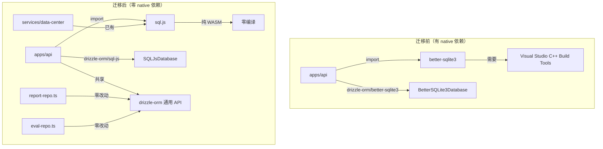

## 用户需求

针对本地 pnpm 环境因 Windows 文件系统损坏无法安装 better-sqlite3 native 模块的问题，提供一套完整的开发与测试工作流解决方案。

## 产品概述

将 `apps/api` 从 `better-sqlite3`（需 C++ 编译）迁移到 `sql.js`（纯 WASM，零编译），使整个 workspace 零 native 依赖。同时为前端测试补充 fetch mock 机制，增强 CI 流水线以覆盖 Python 测试和 API 冒烟验证，并产出本地环境补救指南文档。

## 核心功能

1. **DB 抽象层迁移**：`apps/api/src/storage/connection.ts` 从 `better-sqlite3` 迁移到 `sql.js`，参照 `services/data-center` 已有实现模式，保持 repo 层零改动
2. **前端测试 Mock**：`apps/web/tests/setup.ts` 添加 `globalThis.fetch` mock，防止 jsdom 环境下真实网络请求导致测试噪声和超时
3. **CI 自动化增强**：`.github/workflows/ci.yml` 增加 Python 测试和 API 冒烟验证步骤
4. **文件系统补救指南**：产出 `docs/dev-workflow.md` 文档，涵盖 pnpm store 修复、Windows 兼容配置、故障排除流程

## 技术栈

- **数据库驱动**：`sql.js@^1.12.0`（纯 WASM SQLite，零编译），替换 `better-sqlite3@^12.11.1`
- **ORM**：`drizzle-orm@^0.44.2`（已有依赖，`drizzle-orm/sql-js` 子路径提供 `SQLJsDatabase` 类型）
- **前端测试**：Vitest 3.x + jsdom + `@testing-library/react`，通过 `vi.stubGlobal('fetch', ...)` mock
- **CI**：GitHub Actions，ubuntu-latest，Node 20 + Python 3.11+，pnpm 9
- **Python 包管理**：hatchling build backend，`pip install -e` 可编辑安装

## 实现方案

### 1. DB 抽象层迁移（apps/api → sql.js）

**核心改造**：`apps/api/src/storage/connection.ts`

`services/data-center` 已完成 sql.js 迁移（`services/data-center/src/storage/sqlite/connection.ts`），其 `createSqliteContext(dbPath?)` 是成熟的参照模板。API 侧改造要点：

- `import Database from 'better-sqlite3'` → `import initSqlJs, { type Database as SqlJsDatabase } from 'sql.js'`
- `import { drizzle, type BetterSQLite3Database } from 'drizzle-orm/better-sqlite3'` → `import { drizzle, type SQLJsDatabase } from 'drizzle-orm/sql-js'`
- `ApiDb` 类型：`BetterSQLite3Database<typeof schema>` → `SQLJsDatabase<typeof schema>`
- `initApiDb(dbPath?)` 从同步改为 `async`（sql.js 需异步加载 WASM）
- WASM 路径解析：复用 data-center 的 `resolveWasmPath` 模式（从包目录/cwd 向上查找 `node_modules/sql.js/dist/`）
- 移除 `sqlite.pragma('journal_mode = WAL')`（sql.js 内存数据库无需 WAL）
- DDL 执行：`sqlite.exec(DDL)` → `sqlite.run(DDL)`（匹配 data-center 模式）
- `closeApiDb(persist = true)`：`persist=true` 时先 `db.export()` + `fs.writeFileSync` 持久化到文件，再 `db.close()`；测试场景传 `false` 跳过持久化

**Repo 层零改动验证**：`report-repo.ts` 和 `eval-repo.ts` 仅使用 drizzle 通用 API（`db.insert().values().onConflictDoUpdate()`、`db.select().from().where()`、`db.delete().where()`、`db.select({count}).from()`），这些 API 在 `BetterSQLite3Database` 和 `SQLJsDatabase` 上签名完全一致。`ApiDb` 类型变更对 repo 层透明。

**调用方适配**（`initApiDb` 变为 async）：

- `apps/api/src/index.ts:25`：`initApiDb()` → `await initApiDb()`（已在 top-level async 上下文）
- `apps/api/tests/storage/report-repo.test.ts:15`：`beforeEach` 中 `initApiDb(testDbPath)` → `await initApiDb(testDbPath)`
- `apps/api/tests/storage/eval-repo.test.ts:15`：同上
- `apps/api/tests/routes/report.test.ts:83`：同上
- `apps/api/tests/routes/factor-eval.test.ts:83`：同上
- 所有测试 `afterEach` 中 `closeApiDb()` → `closeApiDb(false)`（测试数据用完即弃，无需持久化）

**依赖变更**（`apps/api/package.json`）：

- 移除 `better-sqlite3: ^12.11.1`（dependencies）
- 移除 `@types/better-sqlite3: ^7.6.13`（devDependencies）
- 新增 `sql.js: ^1.12.0`（dependencies）
- 新增 `@types/sql.js: ^1.4.9`（devDependencies）

### 2. 前端测试 fetch mock

**问题根因**：`useResearchWorkflow` 的 `useEffect`（Task 3 新增）调用 `fetchReports({limit:50})` → `fetch('/api/reports')`；`useTasks` 调用 `useApi(() => fetchTasks())` → `fetch('/api/tasks')`。jsdom + Node 20 内置 fetch 会尝试真实网络请求 `http://localhost/api/...`，导致连接拒绝噪声和潜在超时。

**方案**：在 `apps/web/tests/setup.ts` 中添加 `globalThis.fetch` mock：

- GET 请求返回 `[]`（列表端点）或 `{}`（单资源端点）
- POST 请求返回 `{ id: 'mock-task-id', status: 'pending' }`（满足 `submitBacktest` 解构 `{ id }`）
- DELETE 请求返回 `{ success: true }`
- 所有响应 `status: 200`，`Content-Type: application/json`
- 使用 `vi.fn()` 以便个别测试可覆写特定端点响应

**安全性**：`useApi` hook 内部已有 try/catch 错误处理，`fetchReports` 已有 `.catch(() => {})`。mock 的作用是消除网络噪声和加速测试，不改变错误处理逻辑。

### 3. CI 增强

**当前 CI**（`.github/workflows/ci.yml`）：单 job `lint-test-build`，仅 pnpm lint → test → build → format:check。

**增强内容**：

- 新增 `setup-python` step（Python 3.11）
- 新增 Python 包安装：`pip install -e packages/strategy-runtime -e packages/backtest-engine -e packages/strategies`
- 新增 Python 测试：`pytest`（在 strategies 和 backtest-engine 目录分别运行）
- 新增 API 冒烟测试：构建 API → 启动 `node apps/api/dist/index.js` → 轮询等待就绪 → `curl` 验证 `/api/strategies`、`/api/reports`、`/api/reports/count` → 关闭进程
- sql.js 迁移后 CI 不再需要 C++ 编译工具链，`pnpm install --frozen-lockfile` 即可完整安装

**冒烟测试脚本**（`scripts/smoke-test.sh`）：

- 后台启动 API server，30 秒超时轮询 `/api/strategies`
- 验证 3 个核心端点返回 200
- 退出时 kill 进程

### 4. 文件系统补救指南

产出 `docs/dev-workflow.md`，内容涵盖：

- 环境要求（Node 20+, pnpm 9+, Python 3.11+）
- 初始安装步骤
- 日常开发流程（API dev / Web dev / Python 测试）
- Windows 故障排除：
- pnpm store 损坏：`pnpm store prune` → 删 `node_modules` → `pnpm install`
- 文件路径过长：启用 Windows 长路径支持
- 杀毒软件干扰：添加项目目录到排除列表
- WASM 加载失败：检查 `node_modules/sql.js/dist/sql-wasm.wasm` 是否存在
- CI 流水线说明

## 实现注意事项

### 性能

- sql.js 是内存数据库，每次启动需从文件加载到内存（`fs.readFileSync` + `new SQL.Database(buf)`）。API 层 `data/api.db` 通常 < 1MB，加载延迟可忽略
- `closeApiDb(true)` 的 `db.export()` 会序列化整个内存数据库到 Buffer，再 `fs.writeFileSync`。在 SIGINT/SIGTERM 时执行，不影响运行时性能
- 测试中 `closeApiDb(false)` 跳过持久化，避免每个测试用例写文件

### 向后兼容

- `initApiDb` 签名从同步改为 async 是 breaking change，但所有调用方都在 `apps/api` 内部，无外部消费者
- `closeApiDb` 新增 `persist` 参数默认 `true`，现有 `closeApiDb()` 调用行为不变（生产场景持久化）
- `ApiDb` 类型变更对 repo 层透明（drizzle 通用 API 兼容）

### 影响范围控制

- 不修改 `services/data-center`（已使用 sql.js）
- 不修改 `apps/web/src/` 任何源代码（仅修改 `tests/setup.ts`）
- 不修改 `packages/` 任何 Python 代码
- 不修改 `apps/api/src/storage/report-repo.ts` 和 `eval-repo.ts`（drizzle 通用 API 兼容）

## 架构设计



## 目录结构

```
项目根/
├── apps/api/
│   ├── package.json                              # [MODIFY] 移除 better-sqlite3/@types/better-sqlite3，新增 sql.js/@types/sql.js
│   ├── src/
│   │   ├── storage/
│   │   │   └── connection.ts                     # [MODIFY] 核心迁移：better-sqlite3 → sql.js，initApiDb 改 async，closeApiDb 加 persist 参数
│   │   └── index.ts                              # [MODIFY] initApiDb() → await initApiDb()，closeApiDb() → closeApiDb(true)
│   └── tests/
│       ├── storage/
│       │   ├── report-repo.test.ts               # [MODIFY] await initApiDb()，closeApiDb(false)
│       │   └── eval-repo.test.ts                 # [MODIFY] await initApiDb()，closeApiDb(false)
│       └── routes/
│           ├── report.test.ts                    # [MODIFY] await initApiDb()，closeApiDb(false)
│           └── factor-eval.test.ts               # [MODIFY] await initApiDb()，closeApiDb(false)
├── apps/web/
│   └── tests/
│       └── setup.ts                              # [MODIFY] 添加 globalThis.fetch mock，防止测试中真实网络请求
├── .github/workflows/
│   └── ci.yml                                    # [MODIFY] 新增 Python setup、Python 测试、API 冒烟测试步骤
├── scripts/
│   └── smoke-test.sh                             # [NEW] API 冒烟测试脚本：启动 server → 轮询就绪 → 验证端点 → 清理
└── docs/
    └── dev-workflow.md                           # [NEW] 开发与测试工作流指南，含 Windows 文件系统补救方案
```

## Agent Extensions

### Skill

- **monorepo-management**
- Purpose: 管理 pnpm workspace 依赖变更，确保 better-sqlite3 → sql.js 迁移不影响其他子项目
- Expected outcome: 验证 `apps/api/package.json` 依赖变更后 `pnpm install` 正常工作，无跨包链接问题

### SubAgent

- **code-reviewer**
- Purpose: 审查 connection.ts 迁移后的类型安全性和测试覆盖完整性
- Expected outcome: 确认 repo 层零改动可行、initApiDb async 迁移无遗漏调用方、fetch mock 不破坏现有测试