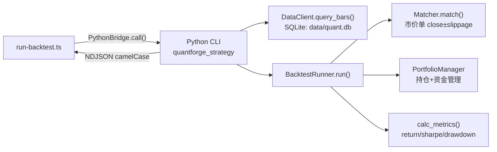

## 产品概述

端到端验证 QuantForge 平台现有经典策略（双均线交叉、RSI 均值回归、布林带突破）在真实 A 股数据下的完整回测链路可用性，确保数据加载、策略执行、撮合引擎、指标计算、报告生成全链路无缝衔接，并评估策略表现是否合理。

## 核心功能

- 修复验证脚本 `scripts/run-backtest.ts` 的字段映射失效问题（snake_case → camelCase），使其与 Python CLI 当前输出对齐
- 扩展验证脚本覆盖全部 3 个策略（dual_ma/rsi/bollinger_band）和多标的测试，支持传入策略参数
- 通过 PythonBridge 直接验证 Python 回测链路（数据加载 → 策略执行 → 撮合 → 指标计算 → 衍生统计）
- 验证完整 HTTP 链路（API 提交任务 → Worker 领取处理 → 报告自动保存 → 报告检索）
- 输出策略表现分析（交易次数、收益率、回撤、夏普比率），执行合理化检查（交易数 > 0、指标非 NaN、权益曲线非平坦）

## 技术栈

- 验证脚本：TypeScript + tsx（`scripts/run-backtest.ts`）
- 回测引擎：Python（quantforge_backtest + quantforge_strategy + quantforge_strategies + quantforge_data）
- 数据源：SQLite（`data/quant.db`，10 个 A 股标的 × 484 根日 K 线，2023-01-01 ~ 2024-12-31）
- HTTP 链路：Fastify API（`apps/api`）+ Worker 轮询（`apps/worker`）+ PythonBridge 子进程

## 实现方案

### 问题根因

Python CLI 的 `_result_to_dict`（`packages/strategy-runtime/quantforge_strategy/commands/backtest.py:171-199`）已通过 `_to_camel` 函数将 dataclass 字段转为 camelCase 输出（`equityCurve`、`totalReturn`、`annualizedReturn`、`maxDrawdown`、`sharpeRatio`、`winRate`），Worker 层 `BacktestResult` 类型（`apps/worker/src/types.ts:28-40`）也已使用 camelCase。但验证脚本 `scripts/run-backtest.ts` 第 46-56 行仍读取旧版 snake_case 字段（`equity_curve`、`total_return`、`annualized_return`、`max_drawdown`、`sharpe_ratio`、`win_rate`），导致所有指标读取为 undefined。

此外，脚本请求未包含 `config.strategyParams`（Worker 的 `BacktestHandler` 已包含此字段），且仅测试了 dual_ma 单策略单标的。

### 修复策略

1. **字段映射修复**：将 `run-backtest.ts` 中 6 处 snake_case 字段访问改为 camelCase，与 Python CLI 输出和 Worker 类型定义对齐
2. **多策略扩展**：添加 dual_ma、rsi、bollinger_band 三个策略的测试，每个策略传入对应 strategyParams（dual_ma: `short_period/long_period`，rsi: `period/oversold/overbought`，bollinger_band: `period/num_std`）
3. **多标的覆盖**：每个策略测试 2-3 个代表性标的（600519 贵州茅台、000001 平安银行、300750 宁德时代），验证策略在不同标的上的表现差异
4. **请求结构对齐**：在 request 的 `config` 中添加 `strategyParams` 字段，与 `BacktestHandler` 构造的请求结构一致
5. **合理化检查**：添加自动化检查——交易数 > 0、权益曲线非平坦（首尾值不同）、指标非 NaN/Infinity、最大回撤 > 0
6. **分析输出**：输出每个策略×标的组合的交易数、收益率、年化收益、最大回撤、夏普比率、胜率，以及前 3 笔交易明细

### 性能与可靠性

- PythonBridge 超时 120s（与 Worker 一致），单标的 484 根 K 线回测在秒级完成
- 验证脚本串行执行策略×标的组合，避免并发 SQLite 读取冲突
- HTTP 链路验证使用内存任务队列（InMemoryTaskService），无需外部消息队列依赖

## 实现注意事项

- `run-backtest.ts` 的 `DB_PATH` 已正确指向 `data/quant.db`（`resolve(import.meta.dirname, "..", "data", "quant.db")`），无需修改
- Python CLI 输出已包含衍生统计（`drawdownCurve`、`monthlyReturns`、`annualReturns`），验证脚本可读取做更深入分析
- `BacktestHandler`（`apps/worker/src/handlers/backtest-handler.ts:36-51`）构造请求时包含 `config.strategyParams`，验证脚本应保持一致
- HTTP 链路验证需先启动 API（`apps/api`）和 Worker（`apps/worker`），Worker 的 `resolveDbPath()` 默认指向项目根 `data/quant.db`
- PowerShell 环境执行 Python 一行命令有引号转义问题，验证脚本通过 `npx tsx` 执行 TypeScript 避免此问题
- 回测引擎默认不启用 A 股市场规则（`enable_market_rules=False`），验证脚本保持一致以简化撮合逻辑验证

## 架构设计

无架构变更，仅修改验证脚本。数据流全链路已打通：



## 目录结构

```
scripts/
└── run-backtest.ts  # [MODIFY] 修复字段映射 snake_case→camelCase（6处），扩展为 dual_ma/rsi/bollinger_band 三策略×多标的验证，添加 config.strategyParams 传入、合理化检查逻辑（交易数>0/指标非NaN/曲线非平坦）和策略表现分析输出（交易明细+指标汇总表）
```

## Agent Extensions

### Skill

- **verification-before-completion**
- Purpose: 在声称端到端验证通过前，强制运行验证命令并确认输出结果，确保回测指标为有效数值、交易数 > 0、权益曲线非平坦
- Expected outcome: 产出行之有效的验证证据，避免虚假通过（如指标 undefined、0 交易、平坦曲线被误判为成功）
- **systematic-debugging**
- Purpose: 验证过程中如发现异常（如某策略 0 交易、NaN 指标、权益曲线平坦），系统化排查根因到具体环节
- Expected outcome: 定位问题到数据加载/策略逻辑/撮合/指标计算的某一环，提供修复方向而非盲目猜测