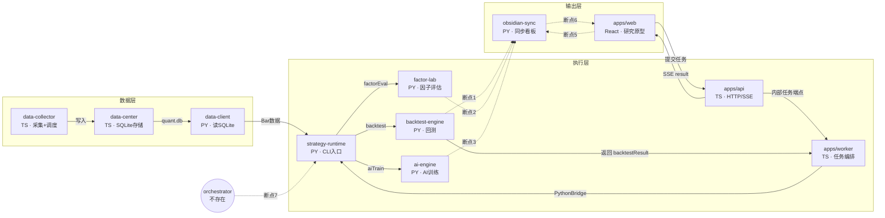

# QuantForge

面向个人量化研究者的策略研究平台。

## 核心闭环

```text
选择策略 → 配置参数 → 运行回测/训练 → 查看任务和报告 → 迭代策略
```

前后端端到端闭环已打通：前端提交回测 → API → Worker → Python CLI → 真实回测指标 → SSE 推送 → 前端报告显示。

## 模块连接图

绿色实线 = 已连通；红色虚线 = 断点或待增强连接



### 已连通链路

```text
data-collector → data-center (SQLite) → data-client → strategy-runtime CLI
  ├→ backtest-engine
  ├→ factor-lab
  └→ ai-engine

apps/web → apps/api → apps/worker → PythonBridge → strategy-runtime CLI
apps/worker → apps/api → SSE → apps/web
```

数据从采集到执行完整可跑，每个模块单独有测试覆盖。前端通过 API/SSE 已能提交回测任务并消费 `progress/log/status/result/error` 事件流，`WorkspacePage` 可渲染真实 `backtestResult` 的指标、权益曲线和交易明细。

### 断点分析

| 断点 | 从 | 到 | 现状 | 修复方式 |
| ---- | -- | -- | ---- | -------- |
| 1 | backtest 结果 | obsidian-sync | CLI 的 `run_backtest` 返回后直接结束，不调用 `SyncService.sync_backtest_result()` | 在 worker `BacktestHandler` 拿到 `backtestResult` 后调用 sync（保持 CLI 纯计算，sync 作为编排动作放 worker，失败可独立重试） |
| 2 | factor 评估结果 | obsidian-sync | `run_factor_eval` 不同步 | 在 worker `FactorEvalHandler` 后置调用 `sync_factor` |
| 3 | AI 训练结果 | obsidian-sync | `run_ai_train` 不同步 | 在 worker AI handler 后置调用 sync |
| 4 | backtest 结果 | apps/web | 已打通：`WorkspacePage` Step 2 消费 SSE `backtestResult`，展示指标、权益曲线和交易明细；后续可继续增强为完整报告页 | 完善报告级可视化、导出和长期任务恢复体验 |
| 5 | web 前端 | obsidian-sync | 前端不触发同步 | 前端加同步触发按钮，调 API 端点 |
| 6 | obsidian 看板 | web 反馈 | Obsidian 看板不回流到前端 | 前端读 Obsidian Local REST API 展示看板 |
| 7 | orchestrator | — | 不存在，无编排层把整条链串起来 | 新建 orchestrator 服务（或扩展 worker 编排能力） |

### 核心问题

`strategy-runtime` CLI 是"一次性 stdin→stdout"设计：接收命令 → 执行 → 返回结果 → 结束。它不会把结果传给下一步，也不持久化。`obsidian-sync` 的 `SyncService` 代码完整（`sync_backtest_result`、`sync_factor`、`sync_all` 都写好了），但执行层（CLI 命令、worker handler）无任何调用方。

### 最小闭环路径

优先打通：`backtest-engine → obsidian-sync`

调用点决策：放在 worker `BacktestHandler` 内（拿到 `backtestResult` 后调用 sync），而非 CLI 命令内。理由：
- 符合 AGENTS.md 边界规则——"Worker 只编排异步任务"，sync 属于编排动作；
- CLI 保持纯计算，不引入 obsidian-sync 依赖；
- sync 失败可独立重试，不影响 CLI 返回结果。

## 项目结构

```text
apps/web                前端研究原型（React + Vite）
apps/api                HTTP API（Fastify + SSE）
apps/worker             异步任务 Worker（HTTP 轮询 + PythonBridge）
services/data-center    数据中心（SQLite + Drizzle，6 数据子域）
services/data-collector 数据采集器（6 数据源适配器，水位增量采集）
packages/backtest-engine  回测引擎
packages/factor-lab     因子工坊（计算 + 评估调度）
packages/strategy-runtime 策略运行时（CLI NDJSON 流式输出）
packages/ai-engine      AI 引擎（特征/训练/预测）
packages/strategies     策略库
packages/data-client    Python 数据客户端
packages/obsidian-sync  Obsidian 同步
runtime/                运行产物（不分配开发 Agent）
```

## 本地运行

```bash
cp .env.example .env   # 复制环境变量模板，填入 API Key 等密钥
pnpm install
pnpm dev
```

所有密钥统一在项目根目录 `.env` 管理（已被 gitignore，不会提交）。

## 验证

```bash
pnpm lint
pnpm test
pnpm build
```

## 边界

当前只做研究和回测原型，不做：真实下单、券商连接、实盘低延迟交易、权限系统、策略市场。

未来实盘执行层必须单独设计：`market_gateway`、`order_gateway`、`risk_guard`、`broker_adapter`。

## 文档约定

- `README.md`：项目概览和运行方式（本文件）
- `AGENT.md`：执行规则、编码规范、已知陷阱
- `AGENTS.md`：多 Agent 角色定义、能力边界、依赖白名单
- 每个可独立开发子项目维护自己的 `README.md` 和 `AGENT.md`
