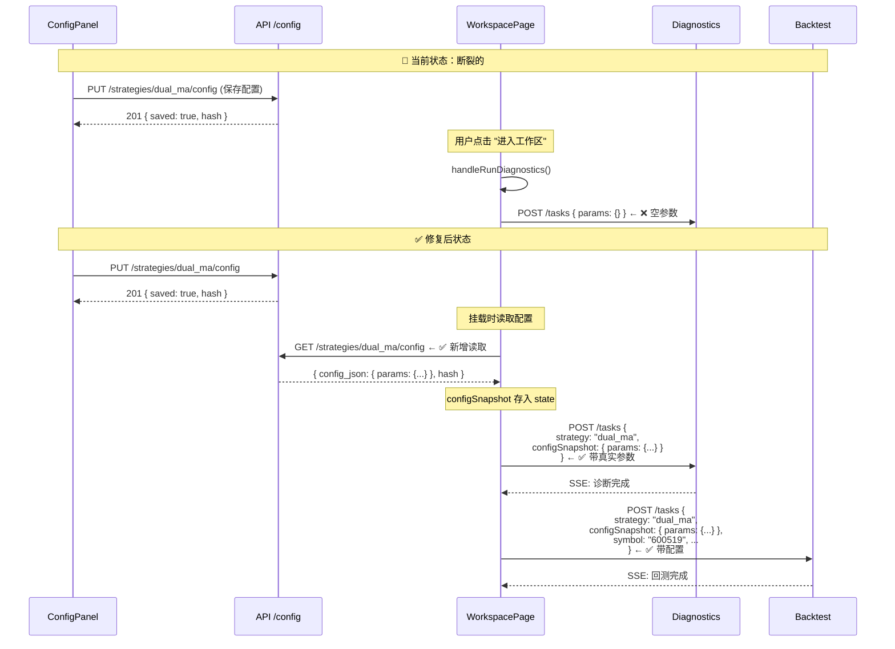
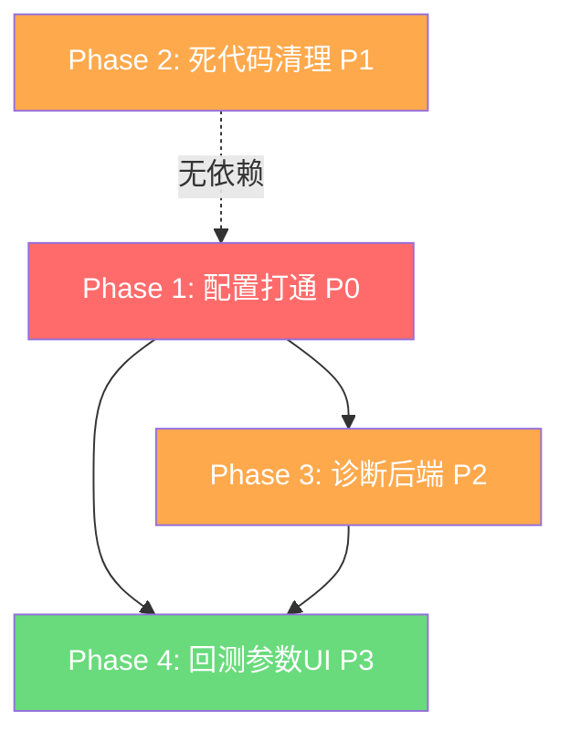

# 策略分类体系下前端工作流对齐与诊断链路打通草案

> **状态：历史草案。** 当前策略分类实施入口为 [../2026-06-30-backend-sync-realign-integrated.md](../2026-06-30-backend-sync-realign-integrated.md)。本文保留为前端双流程、配置链路和 diagnostics 补洞的迁移背景参考。

> **背景**：前端已完成大型重构，按策略分类（FACTOR_BASED / NON_FACTOR / TRANSITIONAL）构建了因子型/非因子型双流程。本文档用于记录前端迁移后的工作流对齐、配置链路打通和 diagnostics 后端补洞草案；**不作为完整后端匹配设计**。
>
> **原始定位**：本文曾作为策略分类主线的动态施工路线图；现在不再作为当前执行入口。
>
> **后续**：后端 API / Worker / Python / DB 契约需要另行制定匹配 06-28 目标基准的设计计划。

---

## 0. 文档治理与当前状态

### 0.1 原始权威入口（已失效）

> 本节为 2026-06-29 当时的文档治理关系。当前执行入口已改为 `docs/plans/2026-06-30-backend-sync-realign-integrated.md`。

| 用途                       | 权威文件                                                                    | 更新频率                                     |
| -------------------------- | --------------------------------------------------------------------------- | -------------------------------------------- |
| 策略分类全栈目标契约       | `docs/specs/2026-06-29-strategy-classification-architecture.md` | 历史关系；现在仅作背景参考                   |
| 策略分类当前施工路线       | `docs/plans/2026-06-29-frontend-workflow-reconciliation.md`                 | 历史关系；现在仅作背景参考                   |
| Ralph / Agent 执行收敛规则 | `.skills/ralph-harness/` 与 `scripts/ralph/AGENT_PROMPT.md`                 | 中频：当执行闭环发现可复用规则或反模式时更新 |

### 0.2 当前执行状态（2026-06-29）

- **当前阶段**：优先执行 Phase 1「配置打通」——让 `WorkspacePage` 读取已保存配置，并把真实 `configSnapshot` 传给 diagnostics / backtest。
- **已完成基线**：三层枚举对齐、前端双流程骨架、ConfigPanel 分支渲染、WorkspacePage 分支渲染。
- **下一步最小闭环**：先用 `dual_ma` / `trend_cta` 跑通一个 `non_factor` 配置 → diagnostics/backtest payload 闭环，再扩展到完整 diagnostics 后端。
- **暂缓事项**：Phase 2 死代码清理不应抢跑；建议等 Phase 1 最小闭环验证后再删除旧 ResearchMode / WorkspaceContent 相关资产。
- **文档同步要求**：代码或执行状态变化后，先更新本文件的状态/Decision Log；只有契约变化才更新架构 spec。

### 0.3 Decision Log

| 日期       | 决策                                                                                                                 | 原因                                                                                                                             | 影响                                                             |
| ---------- | -------------------------------------------------------------------------------------------------------------------- | -------------------------------------------------------------------------------------------------------------------------------- | ---------------------------------------------------------------- |
| 2026-06-29 | `frontend-workflow-reconciliation.md` 作为动态施工路线图，`strategy-classification-architecture.md` 作为稳定目标契约 | 避免 plan/spec 都被当作进度日志，导致后续 agent 判断混乱                                                                         | plan 高频更新，architecture 低频更新                             |
| 2026-06-29 | Phase 1 配置链路优先于 Phase 2 死代码清理                                                                            | 配置链路未通时，清理旧入口容易扩大不确定性                                                                                       | 先验证 `configSnapshot` 闭环，再清理旧体系                       |
| 2026-06-29 | Phase 3 diagnostics 后端先按 MVP 推进，不一次性铺完整算法                                                            | IC、参数敏感性、滑点压力需要算法口径评审                                                                                         | 先跑通 factor/non-factor 主路径，`transitional` 可轻量占位或暂缓 |
| 2026-06-29 | hooks 只做提醒/拦截，不自动改 docs                                                                                   | docs 更新需要语义判断，脚本自动写容易制造错误权威                                                                                | Ralph/agent 显式执行 Doc Sync，hook 只防忘记                     |
| 2026-06-29 | 暂不直接新增 Claude Code hook；先记录建议并依赖 Ralph Doc Sync Gate                                                  | 当前 `.claude/settings.json` 已存在多组 Session/Tool/Stop hooks，贸然新增阻断逻辑可能与现有 clawd-on-desk / claude-mem hook 叠加 | 若后续仍发生 docs 漏同步，再增量添加非阻断 Stop 提醒 hook        |
| 2026-06-29 | `workflowReady` 逻辑已改为 `category==='transitional' \|\| subcategory!==null`（`strategy.ts:26,54`）                | spec §8.3 描述了 transitional 完整工作流，但原逻辑因 subcategory=null 而永远 false                                               | transitional 策略现可进入 WorkspacePage                          |
| 2026-06-29 | `diagnostic_results` 表已存在（`connection.ts:140`），Phase 3 前补 `category` 列，`diagnostics_type` 列暂缓          | 表已建，Open Question #1 已解除；category 列用于按分类过滤历史诊断                                                               | story-17b 实施 migration                                         |
| 2026-06-29 | Python CLI 请求格式统一用 `configSnapshot`，废弃旧 `config` 字段                                                     | Worker 和 Python handler 已约定 configSnapshot；spec §6.1 已同步更正                                                             | 无代码变更，仅文档对齐                                           |

### 0.4 Open Questions

1. ~~诊断结果短期是否继续存 `dataJson` / JSON 字段，还是立即做 `diagnostic_results` schema migration？~~ **已决策**：表已存在，Phase 3 前（story-17b）补加 `category` 列，`diagnostics_type` 暂缓。
2. ~~Worker → Python diagnostics 的最终字段名是否统一为 `configSnapshot`~~ **已决策**：统一用 `configSnapshot`，spec §6.1 已更正。
3. Phase 3 MVP 是否只覆盖 `factor_based` / `non_factor`，`transitional` 先返回轻量评估或 not implemented？（维持 story-18 现有设计：transitional stub 先占位）

### 0.5 Doc Sync Log

| 日期       | 变化                                                                                                      | 已同步                                | 待同步                                  |
| ---------- | --------------------------------------------------------------------------------------------------------- | ------------------------------------- | --------------------------------------- |
| 2026-06-29 | 建立 strategy-classification 文档治理规则：动态 plan、稳定 architecture、Ralph Doc Sync Gate、hook 只提醒 | 本文件、架构 spec、Ralph harness 规则 | 后续每个 Phase 完成后追加状态与决策记录 |

### 0.6 Hook 边界与后续蓝图

当前不让 hook 自动写 docs。若后续仍反复发生“代码变了但 docs 没跟”的问题，再考虑新增**非阻断 Stop 提醒 hook**：

```text
触发时机：Stop
检查逻辑：git diff --name-only 中出现 apps/、packages/、scripts/ 的代码/基础设施变更，但本轮没有 docs/plans、docs/superpowers/specs、docs/development、.skills/ralph-harness 变更时，提示 agent 做 Doc Sync 判断。
行为边界：只提示，不自动编辑；不阻断用户结束会话。
```

不建议的 hook：

- 自动生成 plan/spec 文档
- 自动归档旧文档
- 自动修改 prd.json passes
- 对所有代码变更强制要求 docs diff（会制造噪音，且实现细节变更未必需要文档）

---

## 一、全栈逻辑图

### 1.1 架构总览 — 从策略选择到回测完成

```mermaid
graph TB
    %% ── 用户层 ──
    subgraph User["👤 用户操作"]
        direction LR
        A1[选择策略] --- A2[配置参数] --- A3[进入工作区]
    end

    %% ── 前端 ──
    subgraph Frontend["🖥️ 前端 (apps/web/src/components/)"]
        direction TB

        B1[StrategyGridNew<br/>策略总览] --> B2[ConfigPanel<br/>配置面板]
        B2 --> B3[KlineChart<br/>预览图表]
        B2 --> B4[WorkspacePage<br/>两步工作流]

        B4 --> B5[Step 1: 诊断]
        B4 --> B7[Step 2: 回测]

        B5 --> B6{策略分类}
        B6 --> B6a[因子型<br/>IC/分层/相关性]
        B6 --> B6b[非因子型<br/>参数敏感/信号/滑点]
        B6 --> B6c[过渡型<br/>数据源评估]
    end

    %% ── API 层 ──
    subgraph API["🌐 API 服务 (apps/api/src/routes/)"]
        direction TB
        C1[strategy.ts<br/>GET /strategies]
        C2[config.ts<br/>GET|PUT /config]
        C3[preview.ts<br/>POST /preview]
        C4[task.ts<br/>POST /tasks<br/>SSE /stream]
        C5[diagnostics.ts<br/>GET /diagnostics]
    end

    %% ── Worker 层 ──
    subgraph Worker["⚙️ Worker (apps/worker/src/handlers/)"]
        direction TB
        D1[main.ts<br/>轮询 + 分发]
        D2[BacktestHandler<br/>命令: backtest]
        D3[DiagnosticsHandler<br/>命令: diagnostics ⚠️ 空壳]
    end

    %% ── Python 引擎层 ──
    subgraph Python["🐍 Python 引擎 (packages/)"]
        direction TB
        E1[cli.py<br/>入口分发]
        E2[commands/backtest.py<br/>✅ 已实现]
        E3[commands/diagnostics.py<br/>❌ 待实现]
        E4[commands/analyze.py<br/>✅ 已实现]
        E5[strategy-runtime<br/>策略注册表]
        E6[backtest-engine<br/>回测引擎]
        E7[factor-lab<br/>因子分析引擎]
    end

    %% ── 数据流 ──
    User --> Frontend
    B2 -->|"PUT /strategies/:name/config<br/>保存配置"| C2
    B5 -->|"POST /tasks {type:'diagnostics'}"| C4
    B7 -->|"POST /tasks {type:'backtest'}"| C4

    C4 -->|"轮询 pending"| D1
    D1 -->|"type=diagnostics"| D3
    D1 -->|"type=backtest"| D2

    D3 -->|"streamCall → {command:'diagnostics',...}"| E1
    D2 -->|"streamCall → {command:'backtest',...}"| E1

    E1 --> E3
    E1 --> E2

    E3 --> E7
    E2 --> E6

    C5 -->|"读取"| DB[(SQLite<br/>诊断结果)]
    C2 -->|"读取/写入"| DB
```

### 1.2 两种策略类型的诊断流程对比

```mermaid
graph TB
    subgraph FactorFlow["📊 因子型策略诊断流"]
        direction LR
        F1[ConfigPanel<br/>因子池 + 预处理] -->|保存| F2[PUT /config]
        F2 -->|读取| F3[WorkspacePage]
        F3 -->|POST /tasks| F4[DiagnosticsHandler]
        F4 -->|command:'diagnostics'<br/>category:'factor_based'| F5[Python: FactorDiagnostics]
        F5 --> F6[IC 序列]
        F5 --> F7[分层收益]
        F5 --> F8[相关性矩阵]
    end

    subgraph NonFactorFlow["📈 非因子型策略诊断流"]
        direction LR
        N1[ConfigPanel<br/>窗口参数 + 指标] -->|保存| N2[PUT /config]
        N2 -->|读取| N3[WorkspacePage]
        N3 -->|POST /tasks| N4[DiagnosticsHandler]
        N4 -->|command:'diagnostics'<br/>category:'non_factor'| N5[Python: NonFactorDiagnostics]
        N5 --> N6[参数敏感性热图]
        N5 --> N7[信号质量分析]
        N5 --> N8[滑点压力测试]
    end

    subgraph BacktestFlow["🔄 公共回测流"]
        direction LR
        B1[WorkspacePage Step 2] -->|POST /tasks| B2[BacktestHandler]
        B2 -->|command:'backtest'| B3[Python: run_backtest]
        B3 --> B4[绩效指标]
        B3 --> B5[权益曲线]
        B3 --> B6[交易明细]
        B4 --> B7[AI分析<br/>command:'analyze']
        B5 --> B7
        B6 --> B7
        B7 --> B8[Obsidian同步<br/>command:'syncBacktest']
    end
```



### 1.3 配置快照数据链（最关键的修复点）



---

## 二、诊断链路补齐草案（非完整后端设计）

### 2.1 当前后端结构 vs 需要的结构

| 维度               | 当前状态                                       | 需要改造成                        |
| ------------------ | ---------------------------------------------- | --------------------------------- |
| Python CLI 命令    | 5 个命令，无 `diagnostics`                     | 新增 `diagnostics` 命令，内部分支 |
| DiagnosticsHandler | 通用空壳，echo 模式                            | 分类感知，按 category 传参        |
| 诊断结果类型       | `DiagnosticResult { dataJson: result }` 无结构 | 因子型/非因子型各自的结构化类型   |
| API 响应           | `strategy()` 已返回 `category/subcategory`     | ✅ 已满足，无需改动               |
| Config 服务        | 存 `config_json` 不校验结构                    | ✅ 已满足，无需改动               |
| Mock 数据          | `workspace-page.tsx` 中 `det()` 函数           | 逐步替换为真实后端数据            |

### 2.2 Python CLI 新增 `diagnostics` 命令

```python
# packages/strategy-runtime/quantforge_strategy/commands/diagnostics.py

def run_diagnostics(params: dict, emit: Callable) -> dict:
    """
    策略诊断入口 — 根据 category 分支到不同诊断算法

    输入 params:
      strategy: str          — 策略名
      category: str          — "factor_based" | "non_factor" | "transitional"
      configSnapshot: dict   — { strategy, params }
      symbol: str            — 回测/分析标的
      timeframe: str         — 时间粒度
      dataRange: dict        — { startTs, endTs }

    输出结构（按 category 分支）:
    """
    strategy_name = params["strategy"]
    category = params.get("category", "non_factor")
    config = params.get("configSnapshot", {})

    if category == "factor_based":
        return _diagnose_factor_based(strategy_name, config, params, emit)
    elif category == "non_factor":
        return _diagnose_non_factor(strategy_name, config, params, emit)
    else:
        return _diagnose_transitional(strategy_name, config, params, emit)
```

### 2.3 两种诊断结果类型定义

```typescript
// apps/api/src/types.ts — 新增诊断结果类型

/** 因子型诊断结果 */
export interface FactorDiagnosticsResult {
  type: 'factor_based';
  /** IC 序列（按时间窗口的 IC 值） */
  ic_series: { period: string; ic: number; rank_ic: number }[];
  /** 分层收益（5 层分组） */
  layered_returns: { group: string; return: number }[];
  /** 因子相关性矩阵 */
  correlation_matrix: number[][];
  /** 因子标签 */
  factor_labels: string[];
  /** 分析方法 */
  method: 'pearson' | 'spearman';
  /** 统计摘要 */
  summary: {
    mean_ic: number;
    ic_std: number;
    ic_ir: number;
    mean_rank_ic: number;
  };
}

/** 非因子型诊断结果 */
export interface NonFactorDiagnosticsResult {
  type: 'non_factor';
  subcategory: StrategySubcategory;
  /** 参数敏感性网格 */
  param_sensitivity: {
    param: string;
    values: number[];
    returns: number[];
    sharpe: number[];
  }[];
  /** 信号质量指标 */
  signal_quality: {
    total_signals: number;
    win_rate: number;
    avg_holding_bars: number;
    profit_factor: number;
    max_consecutive_losses: number;
  };
  /** 滑点压力测试 */
  slippage_stress: {
    bps: number;
    return: number;
    sharpe: number;
    trade_count: number;
  }[];
}

/** 过渡型诊断结果 */
export interface TransitionalDiagnosticsResult {
  type: 'transitional';
  data_source_assessment: {
    source: string;
    completeness: number;
    staleness: number;
  }[];
}
```

### 2.4 Worker DiagnosticsHandler 改造

当前：

```
handler → PythonBridge.streamCall({ command: 'diagnostics', strategy, config })
        → Python CLI 无此命令 → echo 回输入
        → 返回 { rawPayload, note: 'not implemented' }
```

改造后：

```
handler → 读取 task.payload 中的 category / configSnapshot
        → PythonBridge.streamCall({
            command: 'diagnostics',
            strategy,
            category,          // 新增：传给 Python 分支
            configSnapshot,    // 新增：真实参数
            symbol,
            timeframe,
            dataRange: { startTs, endTs }
          })
        → Python CLI 执行 diagnostics 命令
        → 返回结构化诊断结果（FactorDiagnosticsResult | NonFactorDiagnosticsResult）
```

### 2.5 API task.ts 完成回调改造

当前 `POST /tasks/:id/complete` 中 Diagnostics 结果的存储方式：

```typescript
if (task.type === TaskType.Diagnostics) {
  const diagnosticResult: DiagnosticResult = {
    id: randomUUID(),
    taskId: task.id,
    strategy: payload.strategy,
    configSnapshot: payload.configSnapshot,
    dataJson: result, // ← 原样存，无结构
    createdAt: Date.now(),
  };
}
```

改造后：`dataJson` 中的 `result.diagnostics` 字段将包含结构化的 `FactorDiagnosticsResult` 或 `NonFactorDiagnosticsResult`，前端可以直接按 `type` 字段分支渲染。

### 2.6 Python 代码组织

```
packages/strategy-runtime/quantforge_strategy/commands/
├── __init__.py
├── ai_train.py         ✅ 不变
├── analyze.py          ✅ 不变
├── backtest.py         ✅ 不变
├── diagnostics.py      🆕 新增 — 诊断入口，按 category 分支
├── factor_eval.py      ✅ 不变
├── sync_backtest.py    ✅ 不变
└── diagnostics/        🆕 新增 — 诊断子模块
    ├── __init__.py
    ├── factor.py       🆕 因子型诊断算法（IC/分层收益/相关性）
    ├── non_factor.py   🆕 非因子型诊断算法（参数敏感/信号质量/滑点）
    └── transitional.py 🆕 过渡型诊断算法（数据源评估）
```

---

## 三、实施计划（结合前序 Block 成果）

### Phase 0：已完成 ✅

- Block 1 — 三层枚举对齐（Python/API/Frontend 10 个 subcategory 值一致）
- 前端双流程骨架（ConfigPanel 分支渲染 + WorkspacePage 分支渲染）

### Phase 1：配置打通（P0）— 前端 + API

> **核心改动**：WorkspacePage 挂载时读取已保存配置，传给诊断和回测。

| #   | 任务                                | 层   | 文件                              | 改动量  |
| --- | ----------------------------------- | ---- | --------------------------------- | ------- |
| 1.1 | 挂载时读取策略配置                  | 前端 | `workspace-page.tsx`              | +15 行  |
| 1.2 | 诊断提交带真实 params               | 前端 | `workspace-page.tsx`              | 改 1 行 |
| 1.3 | 回测提交带 configSnapshot           | 前端 | `workspace-page.tsx` + `tasks.ts` | +5 行   |
| 1.4 | 统一 strategy 标识                  | 前端 | `workspace-page.tsx`              | 改 1 行 |
| 1.5 | 导出 ConfigSnapshot 类型            | 前端 | `types.ts`                        | +5 行   |
| 1.6 | 新增 diagnostics POST 接受 category | API  | `task.ts`                         | +3 行   |

**耗时**：半天

### Phase 2：死代码清理（P1）— 前端

> **核心改动**：删除 ResearchMode 旧体系、旧组件。

| #   | 任务                           | 文件                              | 改动量                    |
| --- | ------------------------------ | --------------------------------- | ------------------------- |
| 2.1 | 删除 `strategy-grid.tsx`       | 删除                              | 安全（已标记 deprecated） |
| 2.2 | 删除/替换 `workspace.tsx` 引用 | `App.tsx`                         | 数行                      |
| 2.3 | 删除 ResearchMode 类型         | `types.ts`, `appData.ts`          | -30 行                    |
| 2.4 | 清理 researchModes 数据        | `en.ts`, `zh.ts`, `accessors.ts`  | -120 行                   |
| 2.5 | 清理 useResearchWorkflow.ts    | `useResearchWorkflow.ts`          | 重写                      |
| 2.6 | 清理 i18n 引用                 | `localization.ts`, `factories.ts` | 数行                      |

**耗时**：半天

### Phase 3：诊断后端（P2）— Python + Worker + API

> **核心改动**：实现 Python CLI `diagnostics` 命令，Worker 分类感知，前端替换 mock。

#### 3a. 算法设计（先出设计文档）

| 策略类型 | 诊断指标   | 算法简述                                            | 依赖            |
| -------- | ---------- | --------------------------------------------------- | --------------- |
| 因子型   | IC 序列    | 计算因子值与下期收益的相关系数时间序列              | factor-lab      |
| 因子型   | 分层收益   | 按因子值分 5 层，计算各层累积收益                   | factor-lab      |
| 因子型   | 相关性矩阵 | 多因子间 Pearson/Spearman 相关                      | factor-lab      |
| 非因子型 | 参数敏感性 | 对每个参数在范围内扫描，运行简化回测，记录收益/夏普 | backtest-engine |
| 非因子型 | 信号质量   | 统计信号频率、胜率、持仓期、盈亏比                  | backtest-engine |
| 非因子型 | 滑点压力   | 在不同滑点假设下运行回测，观察收益衰减              | backtest-engine |
| 过渡型   | 数据源评估 | 检查数据源的完整性、滞后度、质量                    | data-client     |

#### 3b. 实现任务

| #   | 任务                     | 层     | 文件                                 | 说明                                                 |
| --- | ------------------------ | ------ | ------------------------------------ | ---------------------------------------------------- |
| 3.1 | 算法设计文档             | 文档   | `docs/specs/`            | 先出设计，**你评审后再动手写代码**                   |
| 3.2 | Python diagnostics 入口  | Python | `commands/diagnostics.py`            | 按 category 分支调度                                 |
| 3.3 | 因子型诊断算法           | Python | `commands/diagnostics/factor.py`     | IC/分层/相关性                                       |
| 3.4 | 非因子型诊断算法         | Python | `commands/diagnostics/non_factor.py` | 参数敏感/信号/滑点                                   |
| 3.5 | CLI 注册新命令           | Python | `cli.py`                             | 加一行 `_COMMANDS["diagnostics"]`                    |
| 3.6 | 诊断结果类型定义         | API    | `types.ts`                           | FactorDiagnosticsResult / NonFactorDiagnosticsResult |
| 3.7 | DiagnosticsHandler 改造  | Worker | `diagnostics-handler.ts`             | 传递 category、结构化结果                            |
| 3.8 | 前端替换 mock 数据       | 前端   | `workspace-page.tsx`                 | 删除 `det()` 和 `mockData`                           |
| 3.9 | API 诊断路由扩展现有逻辑 | API    | `task.ts`                            | 存储结构化结果                                       |

**耗时**：2-3 天

### Phase 4：回测参数 UI（P3）

| #   | 任务                       | 层   | 文件                 | 说明                            |
| --- | -------------------------- | ---- | -------------------- | ------------------------------- |
| 4.1 | 回测参数表单               | 前端 | `workspace-page.tsx` | symbol/timeframe/资金/日期输入  |
| 4.2 | 默认值从 saved config 推断 | 前端 | `workspace-page.tsx` | 使用 configSnapshot 中的 symbol |

**耗时**：半天

---

## 四、完整依赖图



- **Phase 1（P0-红）**：必须先做，否则配置面板白做
- **Phase 2（P1-橙）**：代码依赖上可与 Phase 1 并行，但治理上建议等 Phase 1 最小闭环验证后再清理，避免误删仍被兜底入口使用的旧体系
- **Phase 3（P2-橙）**：依赖 Phase 1，但**需要先出算法设计文档让你评审**
- **Phase 4（P3-绿）**：锦上添花，优先级最低

---

## 五、风险与注意事项

1. **Phase 3 的算法设计必须先审后做** — IC 计算、参数扫描的具体算法需要确认后再写代码
2. **向后兼容**：Phase 2 删除 `ResearchMode` 时需确认 `useStrategies.ts:25` 的 `mode` 转换已无上游依赖
3. **逐步替换 mock**：Phase 3 建议先让一个 subcategory（如 `trend_cta`）走通全链路，再全面铺开
4. **step 的一致性**：当前前端 step 1 的"确认"按钮没有后端交互，纯粹是前端状态切换
5. **ConfigSnapshot 乐观锁**：`saveStrategyConfig` 支持 `hash`，WorkspacePage 读取后若有并发修改需处理冲突
