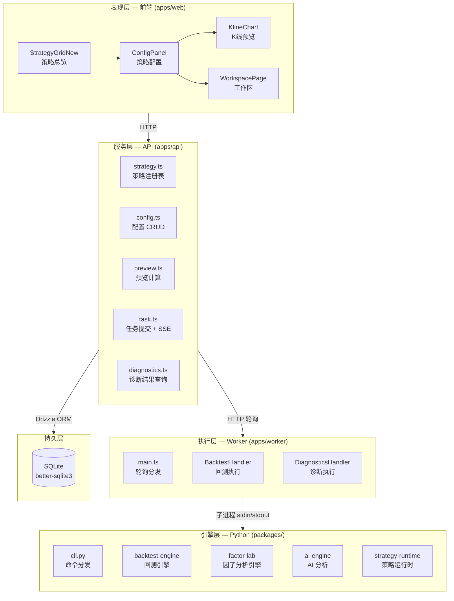
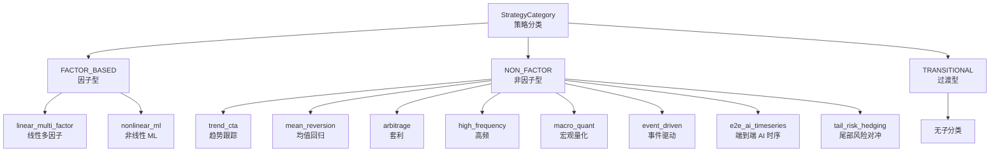
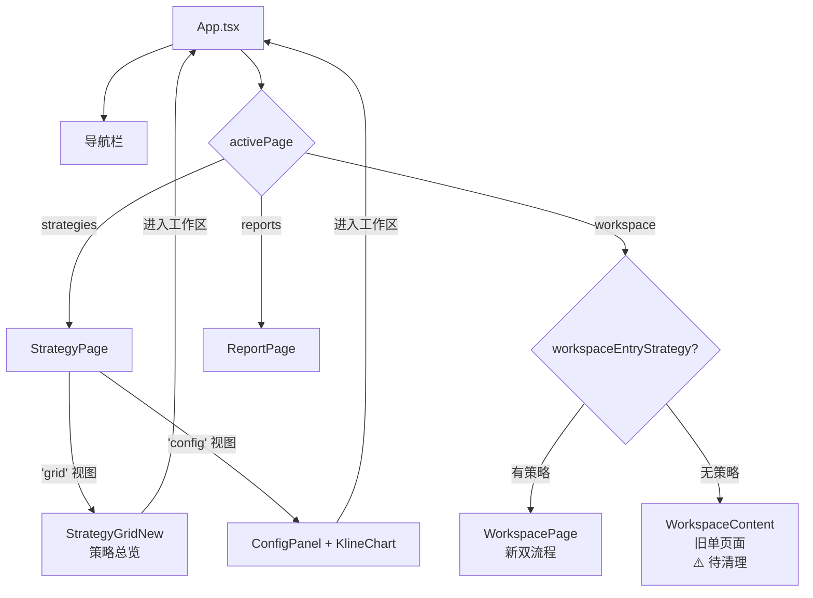
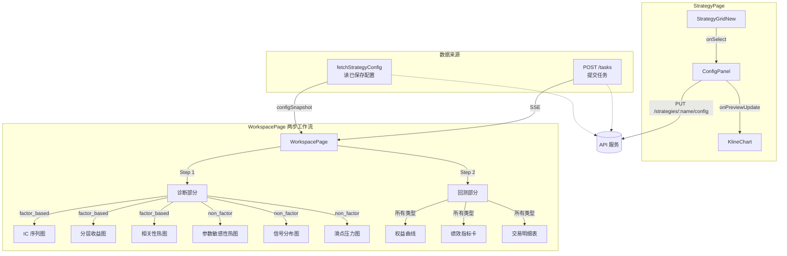
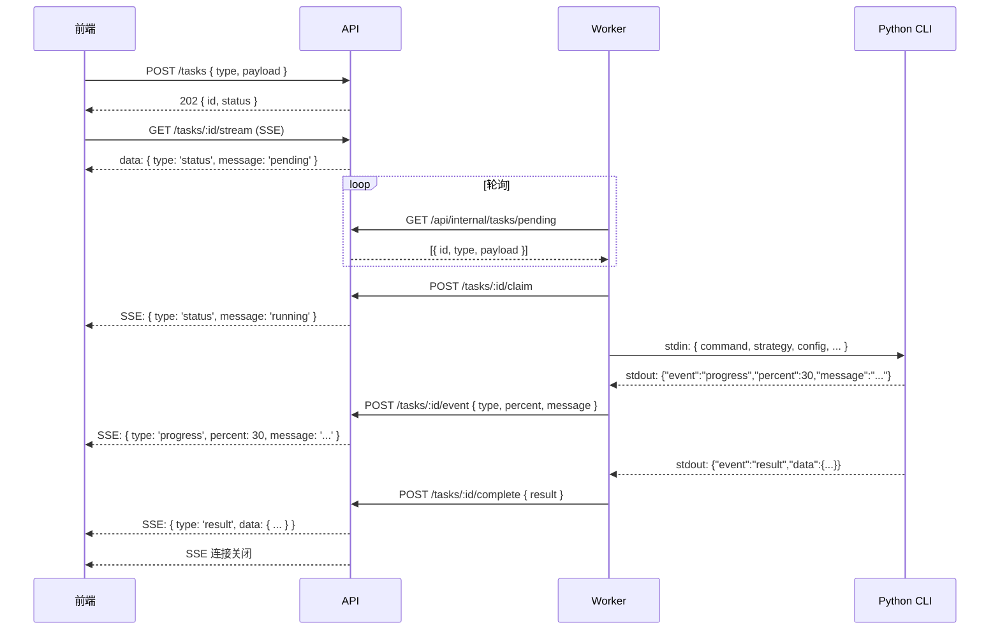
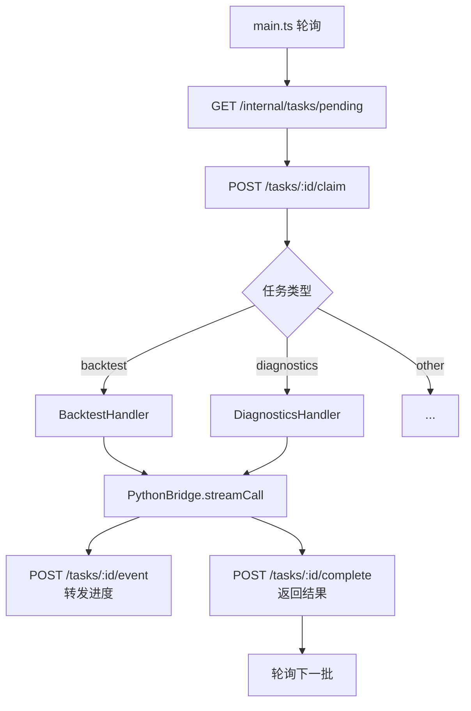
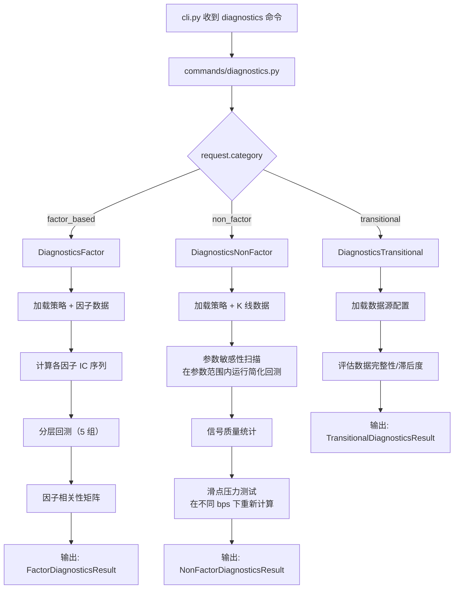
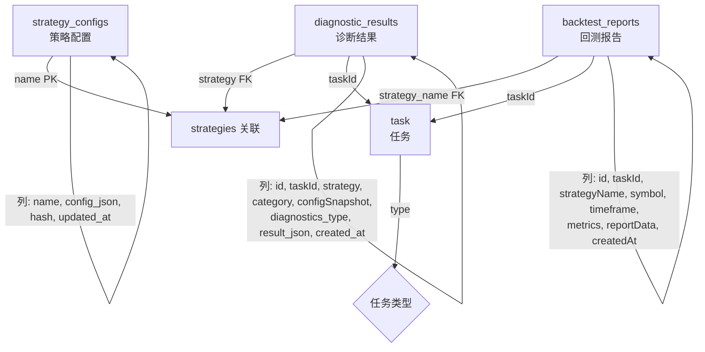
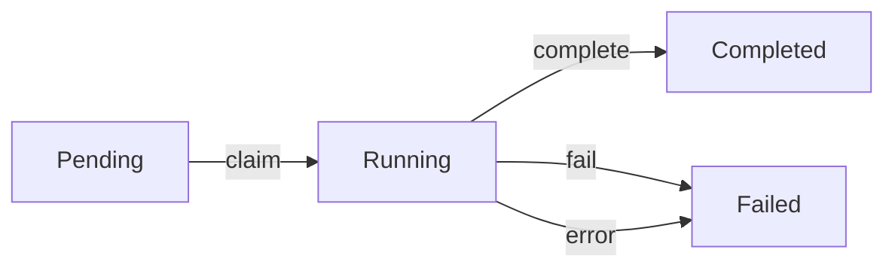

# 策略分类体系全栈架构设计

> **状态：历史架构记录。** 历史实施计划（已归档）：[2026-06-30-contract-realign.md](../plans/archive/2026-06-30-contract-realign.md)，产品目标基准为 [2026-06-28-strategy-class-design.md](./2026-06-28-strategy-class-design.md)。本文保留为 2026-06-29 的全栈结构扫描和背景参考。

> **版本**：v2（策略分类重构后）
> **范围**：前端 → API → Worker → Python 引擎 → 存储的全链路架构
> **原始定位**：本文曾作为策略分类主线的稳定目标契约；现在仅保留为历史架构记录和背景参考
> **核心变更**：从旧的 ResearchMode 三模式（traditional/hft/ai）转变为 StrategyCategory 三级分类（factor_based/non_factor/transitional），前端按分类实现双流程

---

## 0. 文档治理

### 0.1 本文件何时更新

本文件只记录稳定架构契约。只有以下内容变化时才更新：

- API payload / response 字段变化
- diagnostics / backtest 结果结构变化
- DB schema 或持久化字段变化
- 任务状态机或 SSE 事件协议变化
- `StrategyCategory` / `StrategySubcategory` 枚举变化
- 前端 / API / Worker / Python 的职责边界变化

阶段进度、临时阻塞、执行顺序、mock 替换节奏等高频变化，不写入本文件；统一写入 `docs/plans/2026-06-29-frontend-workflow-reconciliation.md`。

### 0.2 当前契约待决项（2026-06-29）

| 待决项                  | 当前建议                                                                       | 落地位置                                 |
| ----------------------- | ------------------------------------------------------------------------------ | ---------------------------------------- |
| diagnostics 结果存储    | 短期继续用 `data_json` JSON 字段；Phase 3 前补 `category` 列（plan story-17b） | 本文件第 7.2 节，plan 文件 Decision Log  |
| `transitional` 支持范围 | MVP 可先轻量占位；优先跑通 `factor_based` / `non_factor`                       | 本文件第 6.3 / 8.3 节，plan 文件 Phase 3 |

---

## 一、系统架构总览



### 1.1 每一层的职责

| 层         | 目录            | 职责                                             | 关键约束                                 |
| ---------- | --------------- | ------------------------------------------------ | ---------------------------------------- |
| **表现层** | `apps/web/`     | 策略选择、参数配置、指标预览、诊断图表、回测报告 | 无 Node.js 依赖，纯浏览器端渲染          |
| **服务层** | `apps/api/`     | REST API、SSE 推送、配置存储、任务编排、类型转换 | Fastify + Drizzle ORM                    |
| **执行层** | `apps/worker/`  | 轮询 pending 任务、调 Python 子进程、转发事件    | 无状态，可水平扩展                       |
| **引擎层** | `packages/*/`   | 回测计算、因子分析、AI 分析、策略注册            | 纯 Python，通过 stdin/stdout NDJSON 通信 |
| **持久层** | `data/quant.db` | 策略配置、诊断结果、回测报告、K 线数据           | better-sqlite3 + WAL 模式                |

### 1.2 技术选型

| 组件          | 技术                             | 版本  |
| ------------- | -------------------------------- | ----- |
| 前端框架      | React + TypeScript + Vite        | —     |
| API 框架      | Fastify                          | —     |
| Worker 运行时 | Node.js (tsx)                    | —     |
| Python 运行时 | CPython                          | ≥3.10 |
| 数据库        | better-sqlite3 + Drizzle ORM     | —     |
| 任务队列      | 数据库轮询（无消息队列）         | —     |
| 通信协议      | HTTP + SSE + stdin/stdout NDJSON | —     |

---

## 二、三层枚举契约

### 2.1 分类体系



### 2.2 契约定义

枚举值在以下三层文件中严格一致（已对齐 ✅）：

```typescript
// 同一组值，三种语言各定义一次：

// Python: packages/strategy-runtime/quantforge_strategy/types.py
// API:    apps/api/src/types.ts
// 前端:   apps/web/src/data/types.ts

StrategyCategory = 'factor_based' | 'non_factor' | 'transitional'

StrategySubcategory =
  | 'linear_multi_factor' | 'nonlinear_ml'        // 因子型
  | 'trend_cta' | 'mean_reversion' | 'arbitrage'  // 非因子型
  | 'high_frequency' | 'macro_quant'               // 非因子型
  | 'event_driven' | 'e2e_ai_timeseries'           // 非因子型
  | 'tail_risk_hedging'                             // 非因子型
```

### 2.3 策略分类与工作流就绪状态

`workflowReady` 属性由后端计算并返回：

```
workflowReady =
  category === 'transitional'            // transitional 无子分类但支持工作流
  || (subcategory !== null && subcategory !== undefined)
```

即：`factor_based` / `non_factor` 需有子分类；`transitional` 无论 subcategory 是否为 null 均视为就绪。

---

## 三、前端架构

### 3.1 页面路由结构



### 3.2 组件树与数据流



### 3.3 ConfigPanel — 按分类分支配置

| 配置区域       | `factor_based`      | `non_factor`                 | `transitional`      |
| -------------- | ------------------- | ---------------------------- | ------------------- |
| 策略参数       | ✅ 通用策略参数     | ✅ 通用策略参数              | ✅ 通用策略参数     |
| 因子池         | ✅ 多选因子列表     | ❌                           | ❌                  |
| 预处理方式     | ✅ 标准化/中性化等  | ❌                           | ❌                  |
| 窗口参数       | ❌                  | ✅ lookback/hold 等          | ❌                  |
| 指标工具箱     | ❌                  | ✅ 技术指标开关              | ❌                  |
| 子分类专属字段 | ❌                  | ✅ 如 macro_quant 的宏观因子 | ❌                  |
| 数据源选择     | ❌                  | ❌                           | ✅                  |
| 衰减参数       | ❌                  | ❌                           | ✅                  |
| UI 约束联动    | ✅ `ui_constraints` | ✅ `ui_constraints`          | ✅ `ui_constraints` |

### 3.4 KlineChart — 预览引擎

KlineChart 与 ConfigPanel 并排显示，当用户调整 `chart_relevant` 参数时触发预览刷新：

```
用户调整参数 → 300ms 防抖 → POST /strategies/:name/preview
  → API 加载 K 线数据 → PreviewService.computePreview()
  → 返回 bars + overlays(SMA/MACD/RSI) + signals
  → KlineChart 渲染
```

PreviewService 是纯 TypeScript 实现，策略名无关，只按参数计算指标叠加层。

---

## 四、API 架构

### 4.1 端点总览

| 方法 | 路径                            | 用途                    | 数据源                       |
| ---- | ------------------------------- | ----------------------- | ---------------------------- |
| GET  | `/api/strategies`               | 列出所有策略及其 meta   | Python 策略注册表（同步）    |
| GET  | `/api/strategies/:name`         | 获取单个策略 meta       | Python 策略注册表（同步）    |
| GET  | `/api/strategies/:name/config`  | 读取已保存的策略配置    | SQLite                       |
| PUT  | `/api/strategies/:name/config`  | 保存/更新策略配置       | SQLite                       |
| POST | `/api/strategies/:name/preview` | 预览 K 线 + 指标叠加    | data-center + PreviewService |
| POST | `/api/tasks`                    | 提交任务（诊断/回测等） | TaskService                  |
| GET  | `/api/tasks/:id/stream`         | SSE 流式任务进度        | TaskService                  |
| GET  | `/api/diagnostics/:resultId`    | 获取诊断结果            | SQLite                       |
| GET  | `/api/diagnostics`              | 按策略名列出诊断历史    | SQLite                       |

### 4.2 策略响应格式

```typescript
// GET /api/strategies → StrategyMeta[]

interface StrategyMeta {
  name: string; // snake_case，与注册名一致
  description: string;
  params: StrategyParamDef[];
  version: string;
  kind: 'combined' | 'select' | 'timing' | 'position' | 'composite';
  backtestable: boolean;
  category: StrategyCategory;
  subcategory: StrategySubcategory | null;
  workflowReady: boolean; // subcategory !== null
}

interface StrategyParamDef {
  key: string;
  label: string;
  type: 'number' | 'string' | 'boolean' | 'select';
  default: number | string | boolean;
  min?: number;
  max?: number;
  options?: string[];
  chart_relevant?: boolean; // 改动时触发 KlineChart 重新请求
  ui_constraints?: UIConstraint[];
}
```

### 4.3 任务提交与 SSE 流



### 4.4 任务类型

```typescript
enum TaskType {
  Backtest = 'backtest', // 策略回测
  Diagnostics = 'diagnostics', // 策略诊断
  FactorCompute = 'factor_compute',
  FactorEval = 'factor_eval',
  AITrain = 'ai_train',
  Collect = 'collect',
}
```

### 4.5 诊断载荷与结果

```typescript
// 提交诊断
interface DiagnosticsPayload {
  strategy: string; // 策略名
  category: StrategyCategory; // 用于 Python 分支
  configSnapshot: ConfigSnapshot; // 已保存配置
  symbol: string; // 分析标的
  timeframe: string; // 时间粒度
  dataRange?: { startTs?: number; endTs?: number };
}

// 诊断结果 — 按 category 返回不同结构
interface FactorDiagnostics {
  type: 'factor_based';
  ic_series: { period: string; ic: number; rank_ic: number }[];
  layered_returns: { group: string; return: number }[];
  correlation_matrix: number[][];
  factor_labels: string[];
  summary: { mean_ic: number; ic_std: number; ic_ir: number; mean_rank_ic: number };
}

interface NonFactorDiagnostics {
  type: 'non_factor';
  subcategory: string;
  param_sensitivity: { param: string; values: number[]; returns: number[]; sharpe: number[] }[];
  signal_quality: {
    total_signals: number;
    win_rate: number;
    avg_holding_bars: number;
    profit_factor: number;
  };
  slippage_stress: { bps: number; return: number; sharpe: number; trade_count: number }[];
}

interface TransitionalDiagnostics {
  type: 'transitional';
  data_source_assessment: { source: string; completeness: number; staleness: number }[];
}
```

---

## 五、Worker 架构

### 5.1 任务处理流程



### 5.2 Handler 设计

每个 Handler 是一个 `TaskHandler` 接口的实现：

```typescript
interface TaskHandler {
  readonly type: TaskType;
  handle(task: TaskRecord, onEvent?: TaskEventHandler): Promise<Record<string, unknown>>;
}
```

**BacktestHandler** — 三阶段流水线：

```
1. backtest    → 执行回测 → { trades, equityCurve, metrics }
2. analyze     → AI 分析结果 → { analysis }
3. syncBacktest → Obsidian 同步
```

**DiagnosticsHandler** — 按 category 分支：

```
payload.category === 'factor_based'
  → Python: diagnostics + factor 算法 → { ic_series, layered_returns, ... }
payload.category === 'non_factor'
  → Python: diagnostics + non-factor 算法 → { param_sensitivity, signal_quality, ... }
```

---

## 六、Python 引擎架构

### 6.1 CLI 通信协议

```
stdin:  一行 JSON 请求
stdout: 多行 NDJSON（每行一个事件）

请求格式:
{
  "command": "backtest | diagnostics | analyze | ...",
  "strategy": "dual_ma",
  "configSnapshot": { "strategy": "dual_ma", "params": { ... } },
  "dataRange": { "symbol": "600519", "timeframe": "1d", ... }
}

事件格式:
{"event":"progress","percent":30,"message":"数据加载中..."}
{"event":"result","data":{ ... }}        ← 终态
{"event":"error","error":{"code":"...","message":"..."}}  ← 终态
```

### 6.2 命令注册结构

```python
_COMMANDS = {
    "backtest":      _run_backtest,      # quantforge-backtest
    "diagnostics":   _run_diagnostics,   # 新增：按 category 分支
    "factorEval":    _run_factor_eval,   # quantforge-factor
    "aiTrain":       _run_ai_train,      # quantforge-ai
    "analyze":       _run_analyze,       # quantforge-ai
    "syncBacktest":  _run_sync_backtest, # obsidian-sync
}
```

### 6.3 Diagnostics 命令分支设计



---

## 七、存储层设计

### 7.1 数据表



### 7.2 诊断结果存储

```sql
CREATE TABLE diagnostic_results (
  id            TEXT PRIMARY KEY,           -- UUID
  task_id       TEXT NOT NULL,              -- 关联的任务
  strategy      TEXT NOT NULL,              -- 策略名
  category      TEXT NOT NULL,              -- factor_based | non_factor | transitional
  config_snapshot TEXT NOT NULL,            -- JSON: { strategy, params }
  diagnostics_type TEXT NOT NULL,           -- 结果类型标识
  result_json   TEXT NOT NULL,              -- JSON: FactorDiagnosticsResult | NonFactorDiagnosticsResult
  created_at    INTEGER NOT NULL            -- 时间戳
);
```

### 7.3 策略配置存储

```sql
CREATE TABLE strategy_configs (
  name         TEXT PRIMARY KEY,            -- 策略名
  config_json  TEXT NOT NULL,               -- JSON: { params, category, subcategory, ... }
  hash         TEXT NOT NULL,               -- 乐观锁
  updated_at   INTEGER NOT NULL
);
```

---

## 八、双流程详细规范

### 8.1 因子型策略工作流

```
策略示例: momentum_selector (linear_multi_factor)

ConfigPanel:
  1. 选择参数: lookback=20, top_k=5
  2. 因子池: [ 'momentum', 'quality' ]
  3. 预处理: z-score 标准化

WorkspacePage Step 1 — 因子诊断:
  1. IC 序列:  计算 momentum 因子与下期收益的 rank IC (12 期)
  2. 分层收益: 按因子值分 5 组，累积收益对比
  3. 相关性:    multi-factor 间的 Pearson 相关矩阵

WorkspacePage Step 2 — 回测:
  → 执行标准回测 → 绩效指标 + 权益曲线 + 交易明细
```

### 8.2 非因子型策略工作流

```
策略示例: dual_ma (trend_cta)

ConfigPanel:
  1. 选择参数: short_period=5, long_period=20
  2. 窗口参数: lookback=30, hold=10
  3. 指标: 加 SMA10/SMA30 到预览

WorkspacePage Step 1 — 参数诊断:
  1. 参数敏感性: short_period [3,5,10,20,30] → 各组合收益
  2. 信号质量:   胜率/盈亏比/持仓期/最大连续亏损
  3. 滑点压力:   1/3/5/10 bps 下的收益衰减

WorkspacePage Step 2 — 回测:
  → 执行标准回测 → 绩效指标 + 权益曲线 + 交易明细
```

### 8.3 过渡型策略工作流

```
策略示例: 从传统策略迁移至因子框架的过渡策略

ConfigPanel:
  1. 数据源选择
  2. 衰减半衰期
  3. 映射目标

WorkspacePage Step 1 — 数据源评估:
  1. 数据完整性 → 缺失率
  2. 数据滞后度 → 最新数据时间
  3. 源质量评级

WorkspacePage Step 2 — 回测:
  → 执行标准回测
```

---

## 九、边界与错误处理

### 9.1 任务状态机



### 9.2 错误码

| 场景         | 触发条件                    | 表现         |
| ------------ | --------------------------- | ------------ |
| 策略不存在   | `strategy.name` 未注册      | API 404      |
| 参数不完整   | 缺少 `category`/`symbol` 等 | Worker 失败  |
| Python 超时  | 回测/诊断超过 120s          | Worker 失败  |
| CLI 无此命令 | Python 未实现               | Worker 捕获  |
| SSE 连接断开 | 前端关闭浏览器              | 后端清理订阅 |

### 9.3 幂等与恢复

- **F5 恢复**：URL 携带 `?diagnosticId=`，WorkspacePage 挂载时通过 `fetchDiagnostic(id)` 恢复诊断结果
- **任务重试**：Worker 认领失败的任务会被重新轮询（不标记失败）
- **SSE 断线重连**：前端 EventSource 自动重连（浏览器原生行为）

---

## 十、与旧架构的差异

| 维度     | 旧架构 (ResearchMode)               | 新架构 (StrategyCategory)                |
| -------- | ----------------------------------- | ---------------------------------------- |
| 分类方式 | 开发模式：traditional/hft/ai        | 策略本质：factor/non_factor/transitional |
| 前端路由 | WorkspaceModeTabs 切换模式          | 策略选择 → Config → Workspace            |
| 诊断内容 | 统一显示                            | 按类别分支渲染不同图表                   |
| 诊断数据 | 全 mock (`det()`)                   | Python CLI 真实计算                      |
| 配置传递 | 不保存，会话级                      | API 持久化，跨会话                       |
| 策略就绪 | `workflowReady: true/false`         | 同左，但基于 subcategory 非 null         |
| 组件     | `WorkspaceContent` + `StrategyGrid` | `WorkspacePage` + `StrategyGridNew`      |
